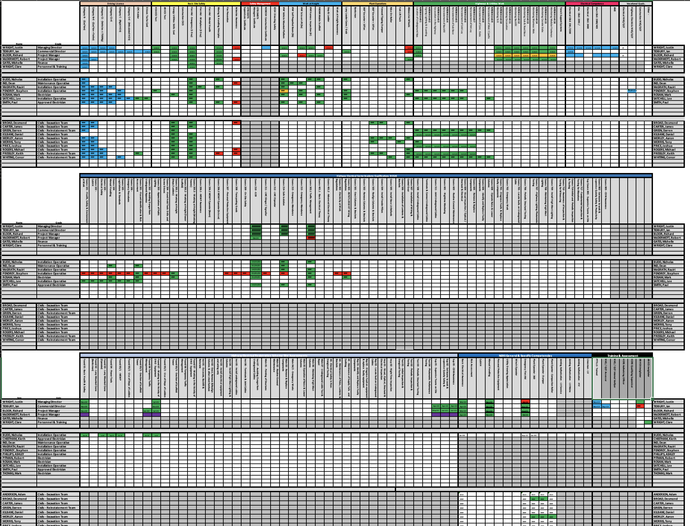

# COM519

# Link to your hosted web application. - 
# Link to your hosted Git Repository  - https://github.com/ErinLynch1/COM519

# Introduction

- online training system 
- currently using an excel spreadsheet but unmanageable - insert screenshot of zoomed out spreadsheet. 
- there will be one main admin user that is in charge of overseeing all training. 
- each person within the company will have a log in to view their own training records as well as upcoming training they have been assigned too. 
- there are multiple types of training, and various qualitifications within that, Each qualification will have its own records within the table
- each user will have their own training record of all the qualitifications, when they have achieved them, when they are valid too and if possible a photo/copy of the certification. 

required because 
- to bring a more streamline process to the handling of training documentation 
- making it more mangable. 

# System Overview
    There are four main interfaces 
        home page this is simple with the only stand out feature will be the box to display the training records that are about to expire and need attention from the main admin 
        the user page - for the admim, this page will disply all the users and their details. From here the admin will be able to add, edit and delete users. For the user themselves, this page will show all of their user details and they will be able to update these for approval from the admin 
        the training page - for the admin, this page will display all the training qualifications that are on the system and who they provider is and how long they are valid for. This page will not display for normal users.
        the records page - for the admin, this page will display each user individual with their training records. The admin will be able to filter/sort these by user and by training. For the normal user, this will be a page of just their training records and when they are validfrom/to etc. 
    There are three main table with my training database 
        - Users - storing all the user information 
        - Training - storing all the qualifications 
        - Records - this takes fields from both other tables and brings them together to assign qualificatiosn to a user. 

A high-level overview of how the system functions, you can use screen shots if it helps. You should consider aspects such as:

Briefly describing all datastores including databases, file systems and media data stores Key views and interfaces
Including a diagram of the key system components and how they are linked

# Key Design Decisions

 
You should rationalise the choices you made in designing your application.

# Database Design

This section will document the different database entities and how they are related. If you are using a relational database you may want to include an entity relationship diagram.

# Security and Scalability

Identify in what ways your application is secure and scalable.

# Conclusion and Reflection

Bring the document to a close by tying together the process, and provide me with a brief reflective account of the entire project.
